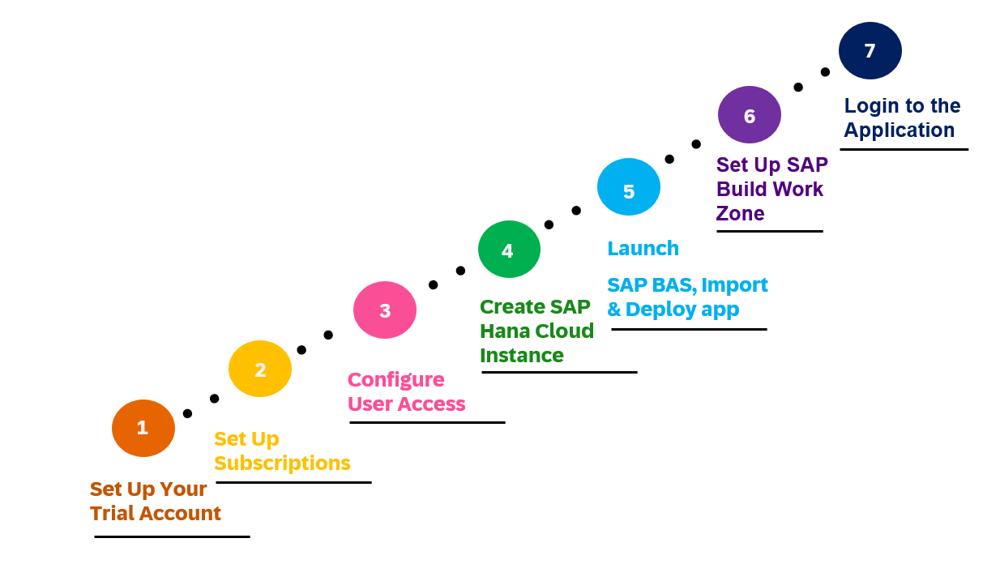
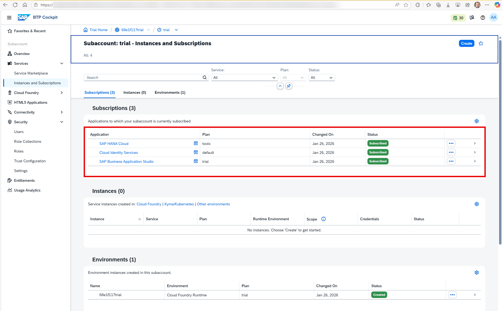
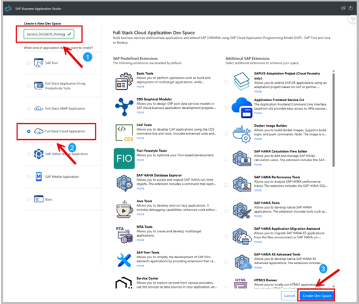

# Environment Setup and Initial Deployment

## 🚀 Quick Start

* **Duration:** 2 hours hands-on workshop
* **What you'll build:** A simple SAP BTP application with security features
* **Prerequisites:** Web browser, SAP BTP Trial Account
* **Setup time:** ~30 minutes
* **Start here:** [Step 1: Set Up Your Trial Account](#step-1-set-up-your-trial-account)

## Set up Process flow Diagram
  <p align="center">
    
    <br>
    <b></b>
  </p>
    
## Table of Contents

- [Overview](#overview)
  - [Business Scenario](#business-scenario)
  - [Solution Diagram](#solution-diagram)
- [Step 1: Set Up Your BTP Trial Account](#step-1-set-up-your-trial-account)
- [Step 2: Set Up Subscriptions](#step-2-set-up-subscriptions)
   - [2.1. Subscribe to SAP HANA Cloud (Trial)](#21-subscribe-to-sap-hana-cloud-trial)
   - [2.2. Subscribe to Cloud Identity Services (Trial)](#22-subscribe-to-cloud-identity-services-trial)
   - [2.3. Establish Trust with SAP Cloud Identity (Trial)](#23-establish-trust-with-sap-cloud-identity-trial)
   - [2.4. Subscribe to SAP Build Work Zone, Standard Edition (Trial)](#24-subscribe-to-sap-build-work-zone-standard-edition-trial)
- [Step 3: Configure Users access](#step-3-configure-users-access)
     - [3.1. Import business users into SAP cloud identity](#31-import-business-users-into-sap-cloud-identity)
     - [3.2. Set Initial Password For Business Users](#32-set-initial-password-for-business-users)
     - [3.3. Map IAS Users to BTP Subaccount](#33-map-ias-users-to-the-btp-subaccount)
     - [3.4. Configure Role Collections](#34-configure-role-collections)
- [Step 4: Create SAP HANA Cloud Instance](#step-4-create-sap-hana-cloud-instance)
     - [4.1. Identify your Organization and Space IDs](#41-identify-your-organization-and-space-ids)
     - [4.2. Create the SAP HANA Cloud Instance](#42-create-the-sap-hana-cloud-instance)
- [Step 5: Launch SAP BAS, Import Project, and Deploy to Cloud Foundry](#step-5-launch-sap-bas-import-project-and-deploy-to-cloud-foundry)
     - [5.1. Create a Dev Space](#41-identify-your-organization-and-space-ids)
     - [5.2. Download and Import the Project](#42-create-the-sap-hana-cloud-instance)
     - [5.3. Deploy to Cloud Foundry](#42-create-the-sap-hana-cloud-instance)
     - [5.4. Assign Role Collections](#42-create-the-sap-hana-cloud-instance)
- [Step 6: Set Up SAP Build Work Zone](#step-7-set-up-sap-build-work-zone)
- [Step 7: Login to the application]()

## Overview 

In these hands-on exercises, we will be using the Incident Management Application, which is designed as a reference application for the [SAP BTP Developer's Guide](https://help.sap.com/docs/btp/btp-developers-guide/btp-developers-guide). It showcases best practices for developing applications on SAP Business Technology Platform (SAP BTP).

- ⚠️ **Note:** To keep this page open, right-click each link and choose **"Open link in new tab"**.

### Business Scenario
ACME, a leading electronics company, uses this application to manage customer service incidents. The application supports the following business process:
  1. A customer contacts ACME's call center with an issue.
  2. A call center representative (processor) receives the call.
  3. The representative creates a new incident in the system based on the customer's complaint.
  4. The conversation details are recorded as part of the incident.

### Solution Diagram
The solution diagram illustrates the key components and their interactions within the Incident Management Application deployed on SAP Business Technology Platform (SAP BTP).

  <p align="center">
    
    <br>
    <b></b>
  </p>

## Step 1: Set Up Your Trial Account

1. Navigate to the [SAP BTP Trial Sign-Up/Login Page](https://account.hanatrial.ondemand.com/).
2. If you don't have a trial account:
    - Click Sign Up and follow the prompts to create your account using your email.
    - Verify your email address to complete registration.
3. Select your preferred region (e.g., US East, Singapore) when prompted.
  <p align="center">
    
    <br>
    <b></b>
  </p>
4.  Click on the subaccount tile (typically labeled trial) to open the SAP BTP Cockpit for your trial subaccount.
  <p align="center">
    
    <br>
    <b></b>
  </p>

## Step 2: Set Up Subscriptions

In this step, you will set up the required application subscriptions

| Application                           | Subscription Plan             | Purpose             |
| :------------------------------       | :--------------- | :---------------    |
| [SAP HANA Cloud](https://discovery-center.cloud.sap/protected/index.html#/serviceCatalog/sap-hana-cloud/?region=all)              | tools             |Provides the database administration tools.|
| [Cloud Identity Services](https://discovery-center.cloud.sap/serviceCatalog/cloud-identity-services/?region=all)       | default |Manages user authentication|
| [SAP Build Work Zone, standard edition](https://discovery-center.cloud.sap/serviceCatalog/sap-build-work-zone-standard-edition/?region=all) | standard         |The Launchpad where you will access your deployed app.|
| [SAP Business Application Studio](https://discovery-center.cloud.sap/serviceCatalog/business-application-studio/?region=all) | standard         |Development environment for building, testing, and deploying cloud applications.|

  ⚠️ **Note:** 
  - Your Trial account comes pre-configured with [SAP Business Application Studio](https://discovery-center.cloud.sap/serviceCatalog/business-application-studio/?region=all) (subscribed) and the
    [Cloud Foundry Environment](https://discovery-center.cloud.sap/protected/index.html#/serviceCatalog/cloud-foundry-runtime?region=all) (enabled). You do not need to add these manually.
  
### 2.1. Subscribe to SAP HANA Cloud (Trial)
  1. From your Trial Subaccount (Cockpit), look at the navigation menu on the left.
  2. Click on **Service Marketplace**.
  3. Search for **"SAP HANA Cloud"** and select it from the results.
  4. Click the three-dot menu **(...)** next to the service name, then choose Create.
  5. In the Create Subscription wizard:
      * Confirm Service is set to "SAP HANA Cloud"
      * Select **Subscription Plan: tools** (free Trial plan)
      * Click **Create**.
  6. After subscription complete, Confirm **Status = "Subscribed"**

### 2.2. Subscribe to Cloud Identity Services (Trial)
Trial accounts have a pre-linked Identity Authentication (IAS) tenant, so subscription and instance setup are simplified:
  1. Return to the **Service Marketplace** in your subaccount.
  2. Search for **"Cloud Identity Services"** and select it from the results.
  3. Click the three-dot menu **(...)** next to the service name, then choose Create.
  4. In the Create Subscription wizard:
      * Confirm Service is set to **"Cloud Identity Services"**
      * Select **Subscription Plan: default**.
      * Click **Create** to initiate the subscription.
  5. After subscription complete, Confirm **Status = "Subscribed"**
  6. Activate your IAS Administration Console access via email:
      * Check your registered email inbox (including spam/junk folders) for an activation message from SAP Cloud Identity Services.
      * Click the activation link in the email, follow the prompts to set a secure password, and log into the Identity Authentication Administration Console to confirm access. This step is optional for Trial trust setup but required for advanced user management later, including adding business users to access your SAP Build Work Zone and deployed applications.

  <p align="center">
    
    <br>
    <b></b>
  </p>

### 2.3. Establish Trust with SAP Cloud Identity (Trial)
Establishing trust allows SAP Cloud Identity Services to act as your central identity provider, enabling secure Single Sign-On (SSO) and centralized management of business users. This connection is a technical requirement for services like SAP Build Work Zone to authenticate users and correctly assign the role collections needed to access applications.

  1. **Navigate to Trust Configuration:** In your BTP subaccount, go to **Security > Trust Configuration**.
  2. **Initiate Trust Setup:** Click the **Establish Trust** button.
  3. **Choose Tenant:** In the wizard, select your pre-linked SAP Cloud Identity tenant and click **Next**.
  4. **Complete and Review:** Follow the remaining steps for **"Configure Main Information"** and **"Configure Identiy provider and Parameters"**, keep the default values in all steps and click on next, then click **Finish** to activate the trust.

  <p align="center">
    
    <br>
    <b></b>
  </p>

### 2.4. Subscribe to SAP Build Work Zone, Standard Edition (Trial)
  1. Return to the **Service Marketplace** in your subaccount.
  2. Search for **"SAP Build Work Zone, standard edition"** and select it.
  3. Click the three-dot menu **(...)** next to the service name, then choose **Create**.
  4. In the Create Subscription wizard:
      * Confirm Service is set to "SAP Build Work Zone, standard edition"
      * Select **Subscription Plan: standard**
  5. After subscription complete, Confirm **Status = "Subscribed"**

At the conclusion of [Step 2: Set Up Subscriptions](#step-2-set-up-subscriptions), your Subscriptions tab will display the complete list of successfully subscribed required services, exactly as illustrated in the following image:

  <p align="center">
    
    <br>
    <b></b>
  </p>

## Step 3: Configure Users access
This section details how to manage users and their access rights within your SAP BTP trial landscape, leveraging SAP Cloud Identity Services (Identity Authentication Service - IAS) as your identity provider.

### 3.1. Import Business Users into SAP Cloud Identity.
  1. Download user data file [IAS-business-users.csv](./IAS-business-users.csv)
  2. Open your web browser and navigate to your IAS tenant's administration console. The URL typically looks like https://<your_tenant_id>.accounts.ondemand.com/admin.
  3. Enter your administrator credentials and log in.
  2. From the main Dashboard, click on the User Management tile.
  3. Click the **Browse** button to select the CSV file you prepared earlier.
  4. Click the Import button at the top right.
  5. Browse and select your IAS-business-users.csv file.
  7. Click Import.
  8. Click Confirm to finalize the import.

### 3.2. Set initial Password for Business users
  1. In the **User Management** screen, search for and click on a user (e.g., alice.jones@acme.com).
  2. Navigate to the **Authentication** tab.
  3. Click on Password Details.
  4. Click on "Set Initial" to manually type a temporary password (e.g.,dsagH@0326) that you will give to the user.
  5. Repeat this for all imported users (bob.smith@acme.com,david.miller@acme.com).

### 3.3. Map IAS Users to the BTP Subaccount
To authorize the users you just created in IAS, you must register them within your specific BTP Subaccount.
  1. Open the SAP BTP Cockpit and navigate to your Subaccount.
  2. In the left navigation pane, expand Security and select Users.
  3. Click the Create button to open the user mapping dialog.
  4. Identity Provider: Select your IAS tenant from the dropdown (e.g., xxxxxx.accounts.ondemand.com(business users)).
  5. User Name, E-mail: Enter the user’s email address (e.g., alice.jones@acme.com). This must match the email used in the IAS import.
  6. Click **Create** to finalize.

### 3.4. Configure Role Collections
To ensure you have full administrative rights to manage the development tools, assign the following role collections to your identity-provider user admin.

1. In the **SAP BTP Cockpit**, go to your **trial subaccount**.
2. On the left-side menu, navigate to **Security → Users**.
3. Click your IAS admin-user email to open the details page.
4. Verify that the **Identity Provider** field shows your IAS tenant.
5. Click **Assign Role Collection**.
6. Search for and select these roles:
   - **`Business_Application_Studio_Administrator`**
   - **`Business_Application_Studio_Developer`**
   - **`Business_Application_Studio_Extension_Deployer`**
   - **`Launchpad_Admin`**
   - **`SAP HANA Cloud Administrator`**
   - **`Subaccount_Viewer`**
7. Click **Assign**.

## Step 4: Create SAP HANA Cloud Instance
In this step, you will provision a new SAP HANA Cloud database instance and map it to your Cloud Foundry environment. This allows your applications and development tools (like SAP Business Application Studio) to interact with the database.

### 4.1 Identify your Organization and Space IDs
Before creating the instance, you need to know where it will be mapped.
  1. In your **SAP BTP Cockpit**, go to your **Trial Subaccount > Overview**.
  2. Click on **Cloud Foundry Environment** tab.
  3. Locate and copy the **Org ID** (a long GUID, e.g., ceae01ac-759a-4e56-8ac8-ef4a0a8b9fa2).

   <p align="center">
    
    <br>
    <b></b>
  </p>

  6. Go to **Cloud Foundry > Spaces**, then click on your space (e.g., dev).
  7. Copy the Space ID from the URL:
      - Look at your browser's address bar. The URL format is:**../org/\<ORG-ID\>/space/\<SPACE-ID\>/applications**
      - Copy the alphanumeric string after **/space/** and before **/applications**, e.g,84304933-24e6-popo-950a-46105da935d0
  8. Save both IDs for [Step 4.2 Create the SAP HANA Cloud Instance](#42-create-the-sap-hana-cloud-instance).

### 4.2 Create the SAP HANA Cloud Instance
1. Navigate to **Services > Instances and Subscriptions**.
2. Find **SAP HANA Cloud** under the **Subscriptions tab** and click the **Go to Application** icon to open **SAP HANA Cloud Central**.
3. If you are prompted for login, choose the **custom IDP** and login with your admin user.
4. In the new tab, click **Create Instance**.

5. Step 1: **Type:**
    * Select **SAP HANA Cloud** in **Instance Type**
    * Select **Configure manually** from the **Instance Configuration** options.
    * Click **Next** Step.

6. Step 2: **SAP HANA Database: General**
    * **Instance Name**: e.g., hanadb.
    * **Administrator Password:** Set a strong password for the DBADMIN user.
    * Click **Next** Step.

7. Step 3: **SAP HANA Database: Sizes and Availability**
    * Leave default trial sizing and availability settings unchanged.
    * **Next** Step.

8. Step 4: **SAP HANA Database: Connections**
    * Under **Allowed Connections**, select **Allow all IP addresses**. This is required for trial and development access.
    * Click **Next** Step.

9. Step 5: **SAP HANA Database: Advanced Settings**
    * Keep default settings for **Version** and **Additional Features**.
    * **Instance Mapping**
        * Click **Add Mapping**.
        * **Environment Type:** Keep default as **Cloud Foundry**.
        * Paste your **Organization ID** and **Space ID** (copied from [Step 4.1 Identify your Organization and Space IDs](#41-identify-your-organization-and-space-ids)) into the **Environment Instance ID** and **Environment Group** fields.
        * Click Next Step.

10. Step 6: **Data Lake: general**
    *  Keep default settings for **Create Data Lake**.
    *  Click **Review and Create**.

12. Step 7: **Review New Instances**
    * Verify all details, especially the Instance Mapping configuration.
    * Click **Create Instance**.
   
13. Step 8: **Verify Instance Creation**
    * Wait for the instance to be provisioned. This may take several minutes.
    * Once complete, you will see your instance (e.g., hanadb) listed in the All Instances view with a Running status (green indicator).
    * Confirm the Type shows SAP HANA Database and the instance is ready for use.
   
  <p align="center">
    
    <br>
    <b></b>
  </p>

## Step 5: Launch SAP BAS, Import Project, and Deploy to Cloud Foundry
### Oveview
In this step, you will use SAP Business Application Studio (BAS) to import, build, and deploy the Secure Incident Management application to your Cloud Foundry environment on SAP BTP.

SAP Business Application Studio is a modern, cloud-based development environment designed for building and extending SAP applications. It provides preconfigured dev spaces that include all required tools, runtimes, and extensions for full-stack cloud application development.

During this step, you will:

* Create a dedicated BAS dev space for the application.
* Import the provided project archive into BAS.
* Build and deploy the application to Cloud Foundry using either the BAS UI or the command line.
* Ensure the application is accessible by assigning the required user role collections.

By the end of this step, the Secure Incident Management application will be successfully deployed on SAP BTP Cloud Foundry, and authorized users will be able to access and use it.

### Step 5.1 Create a Dev Space:

1. Open SAP Business Application Studio (BAS) from your BTP Cockpit.

    * Navigate to **Services > Instances and Subscriptions**.
    * Find **SAP Business Application Studio** under the **Subscriptions** tab and click the **Go to Application** icon.

  <p align="center">
      
      <br>
      <b></b>
  </p>
    
    * If prompted for login, select your Custom Identity Provider (IdP) and sign in with your admin user.

  <p align="center">
      
      <br>
      <b></b>
  </p>
    
2. Click **Create Dev Space**.
3. Enter the **Dev Space name: secure_incident_management**.
4. Select **Full Stack Cloud Application** as the application type.
5. Click **Create Dev Space**.

  <p align="center">
    
    <br>
    <b></b>
  </p>

6. Wait for the Dev Space **status** to change to **Running**, then click on the Dev Space name to open it.
<p align="center">
  
  <br>
  <b></b>
</p>

### Step 5.2 Download and Import the Project:
1. Download the project file secure-incident-management.tar from the following link:
  👉 [Download Secure Incident Management Project]( https://DSAG-TechXChange-XP260/releases/download/untagged-a3e4aca324f4ce9e0992/secure-incident-management.tar)
2. Save the file locally on your machine. This archive will be imported into SAP Business Application Studio in the next step.

### 5.2 Import Project to BAS
BAS-import-project.png
1. In the BAS Explorer pane, click Import Project.
2. Select the secure-incident-management.tar file from your local machine and import it.
<p align="center">
  
  <br>
  <b></b>
</p>

4. The import is complete only when the project folder appears in the Project Explorer and its structure (such as mta.yaml) is fully loaded.


4- To demonstrate real-world access control, you'll test the application using dedicated accounts with **precisely scoped** role collections. Unlike your **xp260-0xx@education.cloud.sap** training account's broad privileges, these users showcase how proper role assignments enforce **least privilege** in production:
  - **bob.support@company.com** (Support user)
  - **alice.support@company.com** (Support user)
  - **david.admin@company.com** (Admin user)
  - Check the user role collections in the SAP BTP cockpit for **Bob, Alice, and David**
  - Select a user. In the right frame, check the role collections assigned:
      - Check if **bob.support@company.com** and **alice.support@company.com** are assigned to the role collection **Incident Management Support**. 
      - Check if **david.admin@company.com** is assigned to the role collection **Incident Management Admin**.

 <p align="center">
    
    <br>
    <b></b>
  </p>

## Review the Development Environment
 
1- As we are using Cloud Foundry, check under **Cloud Foundry > Org Members**, if your platform user **xp260-0XX@education.cloud.sap** has **Org Manager, Org User** under **Org Roles**. 

 <p align="center">
    
    <br>
    <b></b>
  </p>

2- Under **Cloud Foundry > Spaces**, verify the existence of your space called **'XP260-0XX'**.
  
 <p align="center">
    
    <br>
    <b></b>
  </p>

3- Under Space **XP260-0XX > Space Members**, verify if your platform user **xp260-0XX@education.cloud.sap** has **Space Developer, Space Manager** under **Space Roles**.

 <p align="center">
    
    <br>
    <b></b>
  </p>

## Launch SAP Business Application Studio

Now after these checks, you can open the SAP Business Application Studio. 

1- Navigate to **Services > Instances and Subscriptions** in the **SAP BTP cockpit**. Then click on the small **Go to Application** icon next to the name SAP Business Application Studio.

 <p align="center">
    
    <br>
    <b></b>
  </p>

2- On the logon screen, click on the custom identity provider (IDP) **akihlqzx8.accounts.ondemand.com** to login with single sign-on (SSO). 
- ⚠️ **Note:**
    - If prompted for an **Origin Key**, enter: **akihlqzx8-platform**.
    - Always select the Custom Identity Provider **akihlqzx8.accounts.ondemand.com** when authenticating during exercises.
 <p align="center">
    
    <br>
    <b></b>
  </p>

3- Enter email and password in the login window.
- ⚠️ **Note:** You may not see this step if you're already authenticated through SSO.

 <p align="center">
    
    <br>
    <b></b>
  </p>

4- You will see your Dev Space called 'secure_incident_management'. Make sure it is in a **RUNNING** state, if not start it.

 <p align="center">
    
    <br>
    <b></b>
  </p>
  
5- When it is running, click on **secure_incident_management** to open the SAP Business Application Studio with your incident management application.

 

6- Click on **incident-management** to open the application in your workspace.

 <p align="center">
  
  <br>
  <b></b>
</p>

- In the workspace on the right side, you will find your incident management application in the list of projects.
 <p align="center">
  
  <br>
  <b></b>
</p>

7- **Bookmark your SAP Business Application Studio link**.

## Login to Your Cloud Foundry Environment from SAP Business Application Studio
Once you have SAP Business Application Studio open with your secure incident management project, you need to authenticate with your Cloud Foundry environment to deploy and manage applications. Choose one of the following methods to log in:

### 1. Login Using the User Interface (UI)

1. In SAP Business Application Studio, open the **Command Palette** (press **Ctrl+Shift+P** or select **View > Command Palette**) from the top menu.

<p align="center">
  
  <br>
  <b></b>
</p>
  
2. Search for and select **CF: Login to Cloud Foundry**.

<p align="center">
  
  <br>
  <b></b>
</p>

3. You’ll see **Cloud Foundry Sign In and Targets**. Select **SSO Passcode** and click on the link **Open New Browser** to generate your SSO Passcode.
<p align="center">
  
  <br>
  <b></b>
</p>

4. Select **Sign in** with your user **xp260-0XX@education.cloud.sap (origin: akihlqzx8-platform)**.
- ⚠️ **Note:** If your account is not displayed, click **Sign in to another account**.

<p align="center">
  
  <br>
  <b></b>
</p>

5. You’ll see a passcode page, copy the temporary authentication code generated in the **Passcode** field.
<p align="center">
  
  <br>
  <b></b>
</p>

6. Paste the **SSO Passcode** back into the SAP Business Application Studio and click on the **Sign In** button.
<p align="center">
  
  <br>
  <b></b>
</p>

7. In section **Cloud Foundry Target**, select **Organization** and **Space** (for example, `XP260-0XX`), then click on the **Apply** button.
<p align="center">
  
  <br>
  <b></b>
</p>

8. Once connected, a notification message pops up in the status bar in the SAP Business Application Studio confirming that your Cloud Foundry organization and space have been set and are ready for use.

<p align="center">
  
  <br>
  <b></b>
</p>
  
### 2. Login Using the Command Line (Terminal)

1. **Open Terminal**
   - In the SAP Business Application Studio, go to **Terminal > New Terminal** from the top menu.
   - A terminal window will open at the bottom of your workspace in your project directory **secure-incident-management**.

<p align="center">
  
  <br>
  <b></b>
</p>
   
2. **Run the following command to log in:**
  ```
  cf login -a https://api.cf.eu10-004.hana.ondemand.com  --origin akihlqzx8-platform
  ```
3. When prompted enter:
    * Email: xp260-0XX@education.cloud.sap
    * Password: Use the password provided during the session.
    
4.  To verify the login, run
  ```
    cf target
  ```
5- You should see the current organization and space listed.
  
<p align="center">
  
  <br>
  <b></b>
</p>

## Launch SAP Build Work Zone

1- Go back to **Services > Instances and Subscriptions** in the **SAP BTP cockpit**. Click on the **Go to Application** icon next to the **SAP Build Work Zone, standard edition** subscription to open the SAP Build Work Zone Site. 

<p align="center">
  
  <br>
  <b></b>
</p>

2- Check if the **Incident Management** Site is present. Click on the **Go to site** icon. 

<p align="center">
  
  <br>
  <b></b>
</p>

3- When the **Incident Management tile** is displayed, **Sign Out** from your current user **XP260-0xx@education.cloud.sap** and login to the application with the **alice.support@company.com** user. 

<p align="center">
  
  <br>
  <b></b>
</p>

4- Click on the tile to open the incident management application and **bookmark the URL**. 

<p align="center">
  
  <br>
  <b></b>
</p>


Now you are ready to start the exercises. 


## Summary

Now that you have made yourself familiar with the setup,
continue to - [Exercise 1 - Broken Access Control](../ex1/README.md)
